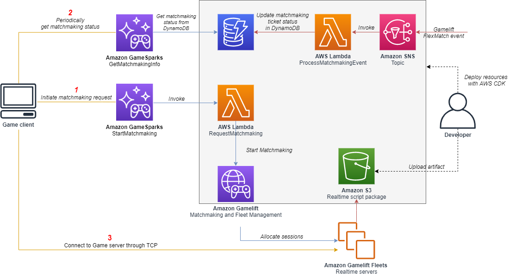

# Multiplayer Session-based Game Hosting on AWS using Amazon GameSparks

 

- [Multiplayer Session-based Game Hosting on AWS using Amazon GameSparks](#multiplayer-session-based-game-hosting-on-aws-using-amazon-gamesparks)
- [Key Features](#key-features)
- [Architecture Diagram](#architecture-diagram)
- [License](#license)

This repository contains a solution for multiplayer session-based game hosting on AWS leveraging Amazon GameLift, a fully managed game server hosting solution, with a managed Amazon GameSparks backend service. The solution is designed for getting quickly started with multiplayer game development on MacOS and Windows. It includes infrastructure as code automation, as well as deployment scripts to deploy all the required resources.

This Readme includes the architecture overview, as well as deployment instructions and documentation for the Amazon GameSparks backend services of the solution.

This solution is accompanied by a blog post: [_Building a multiplayer game with Amazon GameSparks and Amazon GameLift_](https://aws.amazon.com/blogs/gametech/building-a-multiplayer-game-with-amazon-gamesparks-and-amazon-gamelift/).

**Note**: _“The sample code; software libraries; command line tools; proofs of concept; templates; or other related technology (including any of the foregoing that are provided by our personnel) is provided to you as AWS Content under the AWS Customer Agreement, or the relevant written agreement between you and AWS (whichever applies). You should not use this AWS Content in your production accounts, or on production or other critical data. You are responsible for testing, securing, and optimizing the AWS Content, such as sample code, as appropriate for production grade use based on your specific quality control practices and standards. Deploying AWS Content may incur AWS charges for creating or using AWS chargeable resources, such as running Amazon EC2 instances or using Amazon S3 storage.”_

# Key Features
* Uses AWS CDK to automate the deployment of all resources
* Includes automated CloudWatch Dashboards for both the backend and game server resources
* Client works on multiple platforms including mobile

The project is a simple "game" where 1-5 players join the same session and move around with their 3D characters. The movement inputs are sent to the server which runs the game simulation on a headless Unity process and syncs state back to all players. The C++ implementation focuses on the integrations only and doesn't run simulation for the client and server.

# Architecture Diagram

The architecture diagram introduced here focuses on the Amazon GameSparks integration but it also includes the Amazon GameLift components on a high level.

# License

This example is licensed under the Apache 2.0 License. See LICENSE file.